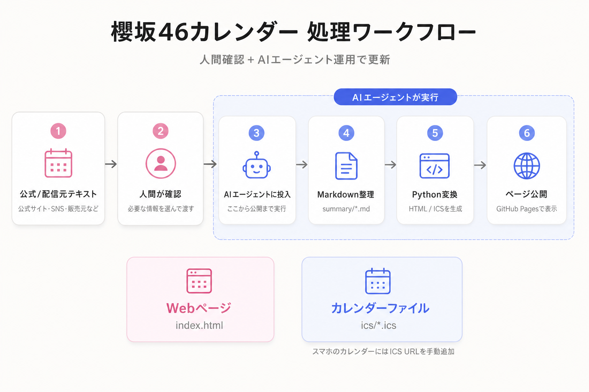

# 櫻坂46 ライブ・イベントカレンダー

櫻坂46のライブ日程・チケット抽選・関連イベントを、見やすい形でまとめるための公開用リポジトリです。
自分用のチケット抽選管理と、確認メモを整理するためのページとして運用しています。

公開ページはこちらです。  
https://mistral-yu.github.io/sakurazaka46-live-event-calendar/

## このページでできること

- ライブ日程・チケット抽選・関連イベントを月ごとに確認できます
- スマホ表示とICS購読に対応しています

## ICSカレンダー購読

### 購読URL

- 全部入り: `https://raw.githubusercontent.com/Mistral-Yu/sakurazaka46-live-event-calendar/main/ics/sakurazaka46_all.ics`
- 締切・開催だけ: `https://raw.githubusercontent.com/Mistral-Yu/sakurazaka46-live-event-calendar/main/ics/sakurazaka46_deadlines.ics`

iPhoneでは、`設定` → `アプリ` → `カレンダー` → `カレンダーアカウント` → `アカウントを追加` → `その他` → `照会するカレンダーを追加` からURLを貼り付けます。

### 通知設定

通知は `設定` → `通知` → `カレンダー` と、`設定` → `アプリ` → `カレンダー` → `デフォルトの通知時間` → `終日イベント` を確認してください。

## データ収集方法

公式サイトや配信元の文章を人間が確認し、必要なテキストをAIエージェントに渡して、カレンダー変換用のMarkdownとして整理しています。

## AI利用について

本リポジトリでは、CodexとHermes Agentを使って情報整理・Markdown化・更新支援を行っています。  
掲載内容は人間が確認・補正していますが、重要な予定は公式サイト・公式SNS・配信元などの一次情報も確認してください。

## 変換元データ

`scripts/render_live_calendar.py` が以下のMarkdownを読み込み、公開ページ `index.html` と購読用ICS `ics/*.ics` に変換します。

- `summary/sakurazaka46_live_summary.md`  
  ライブ日程・チケット抽選情報の元データです。
- `summary/sakurazaka46_event_summary.md`  
  CD発売、ミーグリ、リアルミーグリ、関連イベント情報の元データです。

## 主な公開ファイル

- `index.html`: GitHub Pagesで公開するカレンダー本体
- `summary/*.md`: カレンダー変換元のMarkdownデータ
- `ics/*.ics`: カレンダーアプリ購読用のICSファイル
- `scripts/render_live_calendar.py`: MarkdownからHTML/ICSを生成するスクリプト
- `AGENTS.md`: AIエージェント向けの保守ルール
- `LICENSE`: ライセンス

## ライセンス

このリポジトリで公開している掲載内容・文章・構成・デザイン・公開用HTMLは、**CC BY-NC 4.0**（表示-非営利 4.0 国際）で公開しています。商用利用は許可していません。詳細は `LICENSE` を参照してください。
